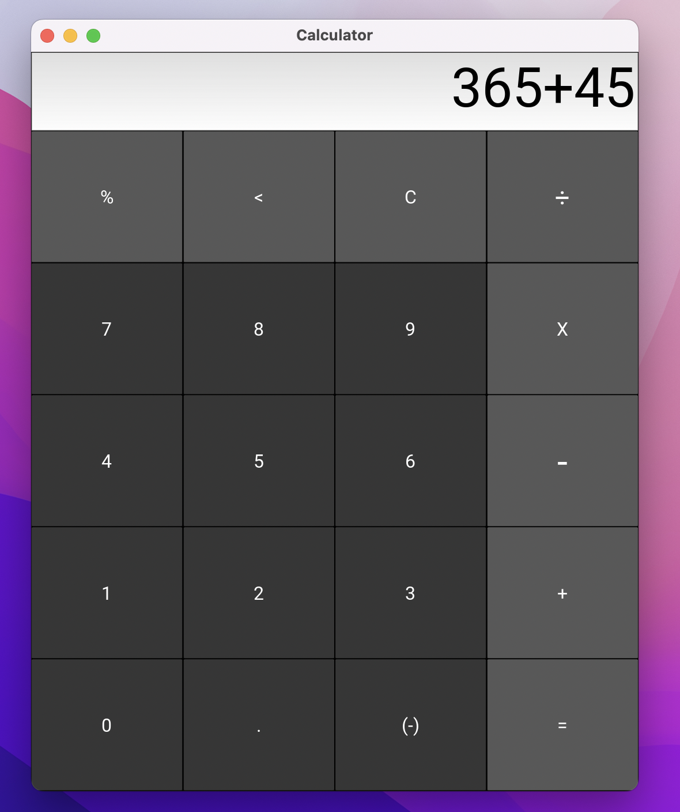

## This is my first project, so I decided to start with building something small and useful.

The main objective of the project was for me to learn the design structure of the Kivy library
 
 
To design the calculator frame, Kivy GUI used a separated file type (.kv) to separate the design portion and the coding/logic portion. 

* The design framework file: calculatorlayout.kv
* The calculator logic file: calculatorapp.py

   
